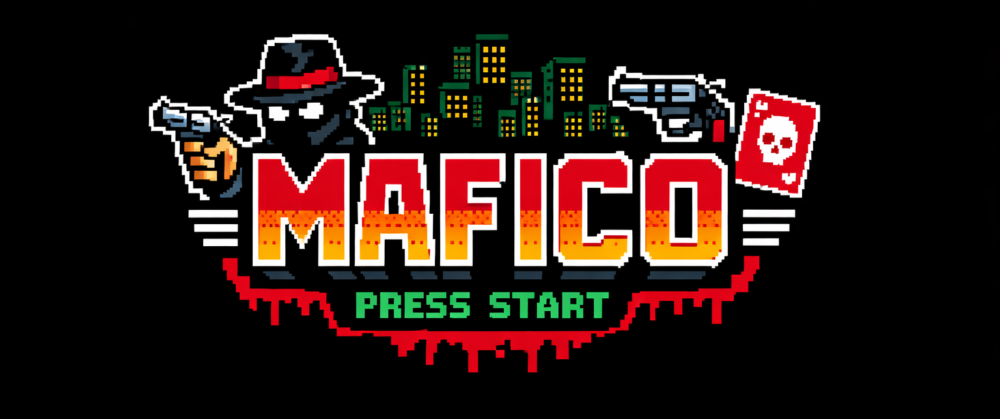
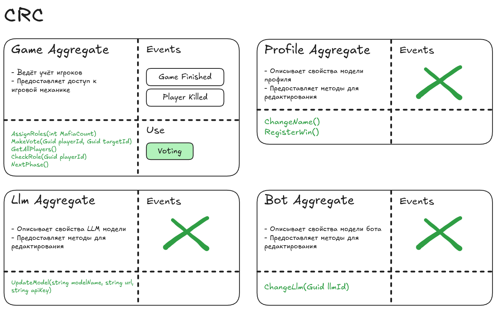
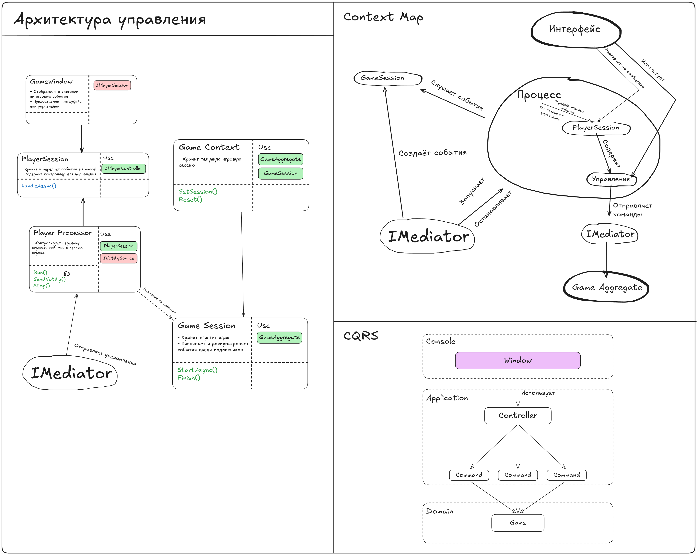

# MafiCo

MafiCo - это песочница для тестирования различных LLM моделей на примере игры *Мафия*: подключение моделей через провайдеров, настройка системных промптов.

> Проект в активной разработке: Логика для ботов (LLM) пока отсутствует.

## Стек

* **ЯП:** С# NET 9
* **Интерфейс:**  Spectre.Console
* MediatR (команды и события)
* **БД:** EF Core & SQLite (профили, боты, настройки LLM).

## Архитектура

Построена на методологии **Domain Driven Design**: логика игры заложена в агрегате `Game` - доменном слое.

Диспатч событий из агрегатов происходит в двух местах: 
1. Через расширение в **UnitOfWork** - `SaveEntitiesAsync()`
2. Прямой вызов через `mediator.DispathGameEvents()`
### Организация 

```
MafiCo.Domain/
├── AggregatesModel/        # Агрегаты: Game, Profile, Bot, Llm и интерфейсы их репозиториев
│   └── GameAggregate/      #   Game, игроки, голосование, доменные события, роли и фазы
├── SeedWork/               # Базовые типы: Entity, IDomainEvent, DomainException
└── Exceptions/, DTOs/      # Доменные исключения и общие read-модели

MafiCo.Application/
├── Bot/, Llm/, Profile/    # Команды и обработчики по фичам
├── Game/                   # Живой матч
│   ├── Controllers/        #   Что игрок может делать сейчас: чат или голосование
│   ├── Mediator/           #   Команды игрока и внутренние события/обработчики игры
│   ├── Notifications/      #   Уведомления, которые видит игрок
│   └── GameContext, GameWorker, PlayerProcessor, PlayerSession
└── Interfaces/             # Контракты, реализуемые во внешних слоях

MafiCo.Infrastructure/
├── Persistence/            # DbContext, конфигурации EF, репозитории, UnitOfWork
└── Migrations/

MafiCo.Console/
├── Program.cs, App.cs      # Сборка хоста, миграции, выбор первого экрана
├── Presentation/           # Роутер экранов, базовый Window и экраны по фичам (Features/)
├── Configuration/          # Чтение и запись appconfig.json (текущий профиль)
└── System/Stores/          # Реализации хранилищ для Application
```

Решение разделено на четыре проекта, зависимости направлены строго внутрь:

| Проект | Роль |
|---|---|
| `MafiCo.Domain` | Агрегаты `Game`, `Profile`, `Bot`, `Llm` и правила игры: раздача ролей, голосование, смена фаз, условие победы |
| `MafiCo.Application` | Сценарии использования в виде MediatR-команд и обработчиков, а также рантайм живого матча |
| `MafiCo.Infrastructure` | Хранение данных: `DbContext`, репозитории, миграции |
| `MafiCo.Console` | Точка входа, DI и экраны TUI |

### Domain cards (CRC) 



### Управление




#### Экраны 
Каждый экран — наследник `Window`, их автоматически находит и регистрирует `AddUi()`. UI не работает с агрегатами напрямую: он отправляет команды через MediatR.

#### Ход матча 
`StartGameHandler` создаёт `Game`, для каждого игрока поднимает `PlayerProcessor` и запускает `GameWorker`. `GameWorker` раздаёт роли и переключает фазы. Всё, что должен увидеть игрок, превращается в уведомление `IGameNotification`. 

Уведомления рассылаются через синглтон `GameContext`, попадают в персональный канал игрока (`PlayerSession`) и отрисовываются экраном `GameSession` (в проекте `MafiCo.Console`).

## Сборка и запуск

```bash
dotnet build MafiCo.sln
dotnet run --project MafiCo.Console/MafiCo.Console.csproj
```

SQLite-база создаётся при старте, миграции применяются автоматически.

Для матча нужно минимум 4 профиля в базе: в игру попадают все существующие профили.

Подробнее о соглашениях и об известных недоделках — в [`CLAUDE.md`](./CLAUDE.md).